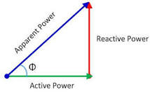

# Power factor (역율)

alternating current에서 device에 걸리는 voltage와 current가 얼마나 효율적으로 일을 했는지를 나타내는 비율.
AC의 경우, imaginary component에 의한 reactive power가 존재하기 때문에, apprent power가 active power와 동일한 DC와 달리, power factor를 고려해야 함.

$$
\frac{\text{Active Power}}{\text{Apparent Power}}
$$

where
* Active Power : 유효전력(P). 실제로 일을 한 전력. 
* Apparent Power : 피상전력 (S=$Ei=VA$). 교류 회로에 걸린 voltage와 current의 곱으로 실제 circuit이 감당해야하는 전력.

$$
\begin{align}
\text{Apparnet Power} &= \text{Voltage} \times \text{Amplare}\\
&= \sqrt{\text{Active Power}^2 + \text{Reactive Power}^2}
\end{align}
$$

* Reactive Power : 무효전력(Q). 전기의 흐름을 방해하는 요소에 의해 발생하는 전력으로 에너지를 주고 받기만 할 뿐 실제로 일을 하지 않음. 단위는 VAR로서 VAR Meter로 측정됨.
   * inductor 소자가 있는 AC circuit의 경우, current를 방해하는 역기전력이 존재함.
   * 이는 current의 흐름을 억제하는 손실로 이어짐.
   * current의 phase가 voltage의 phase보다 느리기(lag)때문에 위상차($\cos{\theta}$)가 발생하는 것으로 이로인해 reactive power가 발생.
   * 유도성 reactance로 인해 증가된 reactive power는 용량성 reactance(current의 phase가 voltage보다 빠름)를 통해 감소시킬 수 있음.

